# Diagram Architektury UI - HealthyMeal MVP

## Analiza Architektury

Diagram przedstawia kompletną architekturę interfejsu użytkownika dla systemu HealthyMeal MVP, z uwzględnieniem nowych wymagań dotyczących autentykacji i zarządzania kontem użytkownika. Architektura wykorzystuje hybrydowe podejście Astro + React, gdzie strony Astro renderowane są po stronie serwera, a komponenty React dodają interaktywność tam, gdzie jest to potrzebne.

### Główne Elementy Architektury:

1. **Warstwa Routingu i Stron** - Strony Astro obsługujące różne ścieżki aplikacji
2. **Warstwa Layoutu** - Komponenty layoutu zapewniające spójną strukturę
3. **Warstwa Komponentów UI** - Komponenty React dla interaktywnych elementów
4. **Warstwa API** - Endpointy do obsługi autentykacji, profilu i przepisów
5. **Warstwa Usług** - Middleware, serwisy, walidacja
6. **Warstwa Danych** - Supabase Auth i Database z RLS

### Kluczowe Zmiany po Implementacji Autentykacji:

- **Nowe strony:** sign-up, sign-in, forgot-password, reset-password, email-confirmation, profile
- **Zaktualizowane strony:** index (warunkowe renderowanie), recipes (dodano header)
- **Nowy layout:** Header.astro z menu użytkownika
- **Nowe komponenty autentykacji:** formularze logowania, rejestracji, resetowania hasła
- **Nowe komponenty profilu:** edycja profilu, preferencje dietetyczne, ustawienia konta
- **Nowe endpointy API:** kompletny zestaw endpointów autentykacji i zarządzania profilem

## Diagram Mermaid

```mermaid
flowchart TD
    subgraph "Warstwa Routingu - Strony Astro"
        Landing["Strona Główna<br/>index.astro<br/>Warunkowe renderowanie"]
        SignUp["Rejestracja<br/>sign-up.astro<br/>Publiczna"]
        SignIn["Logowanie<br/>sign-in.astro<br/>Publiczna"]
        ForgotPassword["Zapomniałem hasła<br/>forgot-password.astro<br/>Publiczna"]
        ResetPassword["Resetuj hasło<br/>reset-password.astro<br/>Z tokenem"]
        EmailConfirm["Potwierdzenie email<br/>email-confirmation.astro<br/>Publiczna"]
        Recipes["Przepisy<br/>recipes.astro<br/>Chroniona"]
        Profile["Profil<br/>profile.astro<br/>Chroniona"]
    end

    subgraph "Warstwa Layoutu - Astro"
        BaseLayout["Layout.astro<br/>Props: title, showHeader, requireAuth"]
        HeaderNav["Header.astro<br/>Props: user<br/>NOWY KOMPONENT"]
    end

    subgraph "Komponenty Nawigacji - React"
        UserMenu["UserMenu.tsx<br/>Dropdown menu<br/>Stan: isOpen<br/>NOWY"]
        SignOutBtn["SignOutButton.tsx<br/>Obsługa wylogowania<br/>NOWY"]
    end

    subgraph "Komponenty Autentykacji - React"
        SignUpForm["SignUpForm.tsx<br/>Formularz rejestracji<br/>Walidacja: email, hasło<br/>NOWY"]
        SignInForm["SignInForm.tsx<br/>Formularz logowania<br/>Walidacja: email, hasło<br/>NOWY"]
        ForgotForm["ForgotPasswordForm.tsx<br/>Formularz odzyskiwania<br/>NOWY"]
        ResetForm["ResetPasswordForm.tsx<br/>Formularz nowego hasła<br/>NOWY"]
    end

    subgraph "Komponenty Profilu - React"
        ProfileForm["ProfileForm.tsx<br/>Edycja profilu<br/>Pola: displayName, email<br/>NOWY"]
        PreferencesForm["PreferencesForm.tsx<br/>Preferencje dietetyczne<br/>Pola: diet, allergens, calorie_target<br/>NOWY"]
        AccountSettings["AccountSettings.tsx<br/>Ustawienia konta<br/>Zmiana hasła, email, usuwanie<br/>NOWY"]
    end

    subgraph "Komponenty Przepisów - React"
        RecipesList["RecipesList.tsx<br/>Główny kontener<br/>QueryClientProvider"]
        RecipesToolbar["RecipesToolbar.tsx<br/>Wyszukiwanie, sortowanie"]
        RecipesGrid["RecipesGrid.tsx<br/>Widok siatki"]
        RecipesListItems["RecipesListItems.tsx<br/>Widok listy"]
        RecipeCard["RecipeCard.tsx<br/>Karta przepisu"]
        RecipeListItem["RecipeListItem.tsx<br/>Element listy"]
        ViewToggle["ViewToggle.tsx<br/>Przełącznik widoku"]
        SearchBar["SearchBar.tsx<br/>Pole wyszukiwania"]
        SortDropdown["SortDropdown.tsx<br/>Menu sortowania"]
        PaginationCtrl["PaginationControls.tsx<br/>Stronicowanie"]
        EmptyState["EmptyState.tsx<br/>Pusty stan"]
        SkeletonLoader["SkeletonLoader.tsx<br/>Ładowanie"]
    end

    subgraph "Hooki React"
        UseRecipesQuery["useRecipesQuery.ts<br/>TanStack Query<br/>Pobieranie przepisów"]
        UseLocalStorage["useLocalStorage.ts<br/>Perzystencja stanu<br/>View mode"]
    end

    subgraph "Komponenty UI - Shadcn"
        Button["button.tsx"]
        Card["card.tsx"]
        Input["input.tsx"]
        Skeleton["skeleton.tsx"]
    end

    subgraph "API Autentykacji"
        AuthSignUp["POST /api/auth/sign-up<br/>Rejestracja użytkownika<br/>NOWY"]
        AuthSignIn["POST /api/auth/sign-in<br/>Logowanie użytkownika<br/>NOWY"]
        AuthSignOut["POST /api/auth/sign-out<br/>Wylogowanie<br/>NOWY"]
        AuthForgot["POST /api/auth/forgot-password<br/>Żądanie resetu hasła<br/>NOWY"]
        AuthReset["POST /api/auth/reset-password<br/>Reset hasła z tokenem<br/>NOWY"]
        AuthVerify["GET /api/auth/verify-email<br/>Weryfikacja email<br/>NOWY"]
        AuthResend["POST /api/auth/resend-verification<br/>Ponowne wysłanie<br/>NOWY"]
        AuthMe["GET /api/auth/me<br/>Pobranie danych użytkownika<br/>NOWY"]
    end

    subgraph "API Profilu"
        ProfileUpdate["PATCH /api/auth/profile<br/>Aktualizacja profilu<br/>NOWY"]
        PasswordChange["POST /api/auth/change-password<br/>Zmiana hasła<br/>NOWY"]
        AccountDelete["DELETE /api/auth/account<br/>Usunięcie konta<br/>NOWY"]
        PreferencesUpdate["PATCH /api/profile/preferences<br/>Aktualizacja preferencji<br/>NOWY"]
    end

    subgraph "API Przepisów"
        RecipesAPI["GET/POST /api/recipes<br/>CRUD przepisów<br/>Istniejący"]
    end

    subgraph "Warstwa Usług i Middleware"
        Middleware["middleware/index.ts<br/>Supabase client<br/>Zarządzanie sesją<br/>ZAKTUALIZOWANY"]
        AuthGuard["get-authenticated-user.ts<br/>Helper autentykacji<br/>Istniejący"]
        RecipeService["recipe.service.ts<br/>Logika biznesowa<br/>Istniejący"]
        AuthValidation["auth.validation.ts<br/>Walidacja Zod<br/>NOWY"]
        RecipeValidation["recipe.validation.ts<br/>Walidacja Zod<br/>Istniejący"]
        ApiErrors["api-errors.ts<br/>Obsługa błędów<br/>Rozszerzony"]
    end

    subgraph "Warstwa Danych"
        SupabaseAuth["Supabase Auth<br/>Autentykacja<br/>Sesje JWT"]
        SupabaseDB["Supabase Database<br/>PostgreSQL<br/>Row Level Security"]
    end

    %% Routing - Strony publiczne
    Landing -->|showHeader: true| BaseLayout
    SignUp -->|showHeader: false| BaseLayout
    SignIn -->|showHeader: false| BaseLayout
    ForgotPassword -->|showHeader: false| BaseLayout
    ResetPassword -->|showHeader: false| BaseLayout
    EmailConfirm -->|showHeader: false| BaseLayout

    %% Routing - Strony chronione
    Recipes -->|showHeader: true<br/>requireAuth: true| BaseLayout
    Profile -->|showHeader: true<br/>requireAuth: true| BaseLayout

    %% Layout zawiera Header
    BaseLayout -->|warunkowo| HeaderNav

    %% Header zawiera komponenty nawigacji
    HeaderNav -->|gdy zalogowany| UserMenu
    UserMenu --> SignOutBtn

    %% Strony używają komponentów formularzy
    SignUp --> SignUpForm
    SignIn --> SignInForm
    ForgotPassword --> ForgotForm
    ResetPassword --> ResetForm
    Profile --> ProfileForm
    Profile --> PreferencesForm
    Profile --> AccountSettings

    %% Strony z przepisami
    Landing -->|gdy zalogowany| RecipesList
    Recipes --> RecipesList

    %% Struktura RecipesList
    RecipesList --> RecipesToolbar
    RecipesList --> RecipesGrid
    RecipesList --> RecipesListItems
    RecipesList --> PaginationCtrl
    RecipesList --> EmptyState
    RecipesList --> SkeletonLoader

    RecipesToolbar --> SearchBar
    RecipesToolbar --> SortDropdown
    RecipesToolbar --> ViewToggle

    RecipesGrid --> RecipeCard
    RecipesListItems --> RecipeListItem

    %% Hooki
    RecipesList --> UseRecipesQuery
    RecipesList --> UseLocalStorage

    %% Komponenty używają UI
    SignUpForm -.->|używa| Button
    SignUpForm -.->|używa| Input
    SignInForm -.->|używa| Button
    SignInForm -.->|używa| Input
    ForgotForm -.->|używa| Button
    ForgotForm -.->|używa| Input
    ResetForm -.->|używa| Button
    ResetForm -.->|używa| Input
    ProfileForm -.->|używa| Button
    ProfileForm -.->|używa| Input
    PreferencesForm -.->|używa| Button
    PreferencesForm -.->|używa| Input
    RecipeCard -.->|używa| Card
    RecipeCard -.->|używa| Button
    RecipeListItem -.->|używa| Card
    SkeletonLoader -.->|używa| Skeleton

    %% Wywołania API - Autentykacja
    SignUpForm ==>|POST| AuthSignUp
    SignInForm ==>|POST| AuthSignIn
    SignOutBtn ==>|POST| AuthSignOut
    ForgotForm ==>|POST| AuthForgot
    ResetForm ==>|POST| AuthReset
    EmailConfirm ==>|POST| AuthResend

    %% Wywołania API - Profil
    ProfileForm ==>|PATCH| ProfileUpdate
    PreferencesForm ==>|PATCH| PreferencesUpdate
    AccountSettings ==>|POST| PasswordChange
    AccountSettings ==>|DELETE| AccountDelete

    %% Wywołania API - Przepisy
    UseRecipesQuery ==>|GET| RecipesAPI

    %% API używa walidacji i serwisów
    AuthSignUp --> AuthValidation
    AuthSignIn --> AuthValidation
    AuthForgot --> AuthValidation
    AuthReset --> AuthValidation
    ProfileUpdate --> AuthValidation
    PreferencesUpdate --> AuthValidation
    PasswordChange --> AuthValidation

    RecipesAPI --> RecipeValidation
    RecipesAPI --> RecipeService

    %% Wszystkie API korzystają z middleware
    AuthSignUp -.->|korzysta| Middleware
    AuthSignIn -.->|korzysta| Middleware
    AuthSignOut -.->|korzysta| Middleware
    AuthForgot -.->|korzysta| Middleware
    AuthReset -.->|korzysta| Middleware
    AuthVerify -.->|korzysta| Middleware
    AuthResend -.->|korzysta| Middleware
    AuthMe -.->|korzysta| Middleware
    ProfileUpdate -.->|korzysta| Middleware
    PasswordChange -.->|korzysta| Middleware
    AccountDelete -.->|korzysta| Middleware
    PreferencesUpdate -.->|korzysta| Middleware
    RecipesAPI -.->|korzysta| Middleware

    %% Strony chronione używają AuthGuard
    Recipes -.->|sprawdza auth| AuthGuard
    Profile -.->|sprawdza auth| AuthGuard
    BaseLayout -.->|gdy requireAuth| AuthGuard

    %% Obsługa błędów
    AuthSignUp -.->|błędy| ApiErrors
    AuthSignIn -.->|błędy| ApiErrors
    RecipesAPI -.->|błędy| ApiErrors
    ProfileUpdate -.->|błędy| ApiErrors

    %% Warstwa danych
    Middleware ==>|zarządza sesjami| SupabaseAuth
    AuthGuard ==>|weryfikuje token| SupabaseAuth

    AuthSignUp ==>|tworzy użytkownika| SupabaseAuth
    AuthSignIn ==>|loguje| SupabaseAuth
    AuthSignOut ==>|wylogowuje| SupabaseAuth
    AuthForgot ==>|wysyła email| SupabaseAuth
    AuthReset ==>|resetuje hasło| SupabaseAuth
    AuthVerify ==>|weryfikuje email| SupabaseAuth
    AuthMe ==>|pobiera dane| SupabaseAuth
    PasswordChange ==>|zmienia hasło| SupabaseAuth

    ProfileUpdate ==>|aktualizuje| SupabaseDB
    PreferencesUpdate ==>|aktualizuje| SupabaseDB
    AccountDelete ==>|usuwa dane| SupabaseDB
    RecipesAPI ==>|CRUD operacje| SupabaseDB
    RecipeService ==>|dostęp do danych| SupabaseDB

    %% Style dla nowych komponentów
    classDef newComponent fill:#e8f5e9,stroke:#4caf50,stroke-width:3px
    classDef updatedComponent fill:#fff3e0,stroke:#ff9800,stroke-width:3px
    classDef existingComponent fill:#f5f5f5,stroke:#9e9e9e,stroke-width:1px

    class SignUp,SignIn,ForgotPassword,ResetPassword,EmailConfirm,Profile newComponent
    class HeaderNav,UserMenu,SignOutBtn newComponent
    class SignUpForm,SignInForm,ForgotForm,ResetForm newComponent
    class ProfileForm,PreferencesForm,AccountSettings newComponent
    class AuthSignUp,AuthSignIn,AuthSignOut,AuthForgot,AuthReset newComponent
    class AuthVerify,AuthResend,AuthMe newComponent
    class ProfileUpdate,PasswordChange,AccountDelete,PreferencesUpdate newComponent
    class AuthValidation newComponent

    class Landing,Recipes,BaseLayout updatedComponent
    class Middleware,ApiErrors updatedComponent

    class RecipesList,RecipesToolbar,RecipesGrid,RecipesListItems existingComponent
    class RecipeCard,RecipeListItem,ViewToggle,SearchBar,SortDropdown existingComponent
    class PaginationCtrl,EmptyState,SkeletonLoader existingComponent
    class UseRecipesQuery,UseLocalStorage existingComponent
    class Button,Card,Input,Skeleton existingComponent
    class RecipesAPI,RecipeService,RecipeValidation,AuthGuard existingComponent
    class SupabaseAuth,SupabaseDB existingComponent
```

## Legenda

### Kolory Komponentów

- 🟢 **Zielony (NOWY)** - Nowe komponenty dodane dla funkcjonalności autentykacji
- 🟠 **Pomarańczowy (ZAKTUALIZOWANY)** - Istniejące komponenty wymagające modyfikacji
- ⚪ **Szary (ISTNIEJĄCY)** - Komponenty bez zmian, już zaimplementowane

### Typy Połączeń

- **→** Strzałka ciągła - Hierarchia komponentów, zagnieżdżenie
- **⇒** Gruba strzałka - Wywołania HTTP API
- **⋯>** Przerywana strzałka - Wykorzystanie usług, zależności

### Grupy Funkcjonalne

1. **Warstwa Routingu** - Strony Astro definiujące ścieżki aplikacji
2. **Warstwa Layoutu** - Komponenty strukturalne (Layout, Header)
3. **Komponenty Nawigacji** - Interaktywne menu użytkownika
4. **Komponenty Autentykacji** - Formularze logowania, rejestracji, reset hasła
5. **Komponenty Profilu** - Zarządzanie profilem i preferencjami użytkownika
6. **Komponenty Przepisów** - Wyświetlanie i zarządzanie przepisami
7. **Hooki React** - Zarządzanie stanem (TanStack Query, localStorage)
8. **Komponenty UI** - Podstawowe komponenty Shadcn/ui
9. **API Autentykacji** - Endpointy do zarządzania użytkownikami
10. **API Profilu** - Endpointy do zarządzania profilem
11. **API Przepisów** - Endpointy CRUD dla przepisów
12. **Warstwa Usług** - Middleware, walidacja, logika biznesowa
13. **Warstwa Danych** - Supabase Auth i Database

## Przepływ Danych

### Przepływ Autentykacji

1. Użytkownik wypełnia formularz (SignUpForm/SignInForm)
2. Komponent React waliduje dane po stronie klienta
3. Wywołanie POST do odpowiedniego endpointu API
4. Endpoint waliduje dane używając Zod (AuthValidation)
5. Endpoint wywołuje Supabase Auth
6. Middleware zarządza ciasteczkami sesji
7. Strony sprawdzają stan autentykacji przez AuthGuard

### Przepływ Zarządzania Przepisami

1. Użytkownik wchodzi na stronę /recipes (chronioną)
2. AuthGuard weryfikuje autentykację
3. RecipesList używa useRecipesQuery (TanStack Query)
4. Query wykonuje GET /api/recipes
5. API używa RecipeService do logiki biznesowej
6. RecipeService komunikuje się z Supabase Database
7. RLS (Row Level Security) wymusza dostęp tylko do własnych przepisów
8. Dane wracają przez warstwy do UI

### Zarządzanie Stanem

- **Stan serwera** - TanStack Query (przepisy, dane użytkownika)
- **Stan lokalny** - React hooks (useState, formularze)
- **Stan persystentny** - useLocalStorage (tryb widoku)
- **Stan URL** - Parametry zapytania (filtry, stronicowanie)
- **Stan sesji** - Ciasteczka HTTP-only (tokeny auth)

## Kluczowe Decyzje Architektoniczne

1. **Hybrydowe Astro + React** - Strony statyczne dla SEO i wydajności, React dla interaktywności
2. **Sesje oparte na ciasteczkach** - Bezpieczne ciasteczka HTTP-only chronią przed XSS
3. **Integracja Supabase Auth** - Delegowanie złożonej logiki autentykacji do sprawdzonej usługi
4. **Walidacja Zod** - Walidacja po stronie klienta i serwera dla integralności danych
5. **Row Level Security** - Bezpieczeństwo na poziomie bazy danych jako dodatkowa warstwa ochrony
6. **TanStack Query** - Eleganckie zarządzanie stanem serwera z cache i optymistycznymi aktualizacjami

